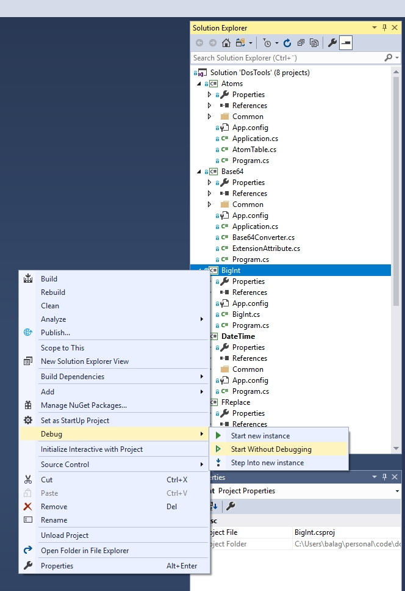

# Start Without Debugging

**Start Without Debugging** is a Visual Studio extension that adds "Start Without Debugging" ("Run") command to Solution Explorer context menu.

**Install extension** directly from Visual Studio using the" Extensions and Updates" dialog, or **download VSIX package** from [Visual Studio Marketplace](https://marketplace.visualstudio.com/items?itemName=vurdalak1.startwithoutdebugging).

